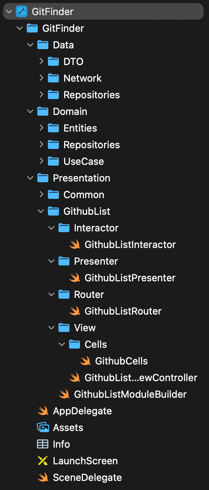
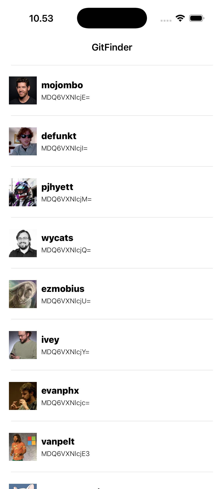

# GitFinder

A small app that shows a list of GitHub usernames, pulled from the public GitHub API. I built it to practice VIPER on top of Clean Architecture.

## Tech stack

- Swift + UIKit, no storyboards
- VIPER (presentation) + Clean Architecture (overall structure)
- URLSession with async/await
- UITableView with a custom cell

## Screenshot

 
