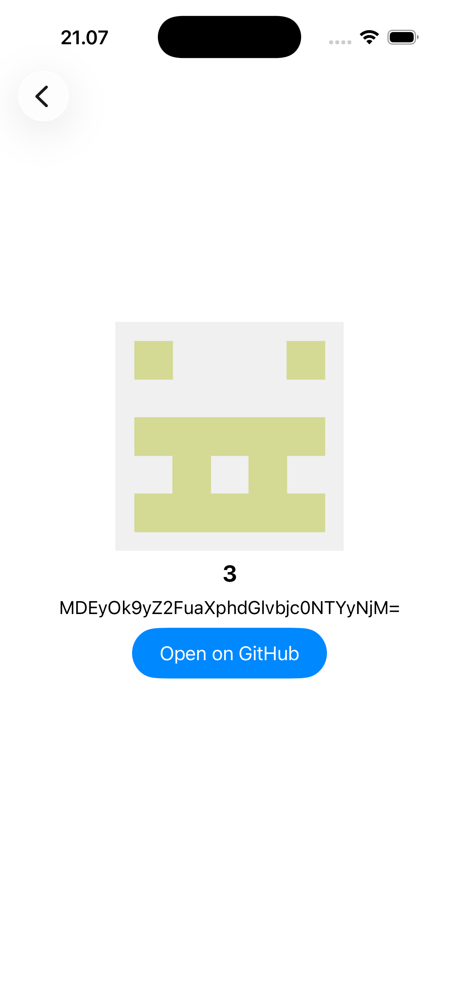
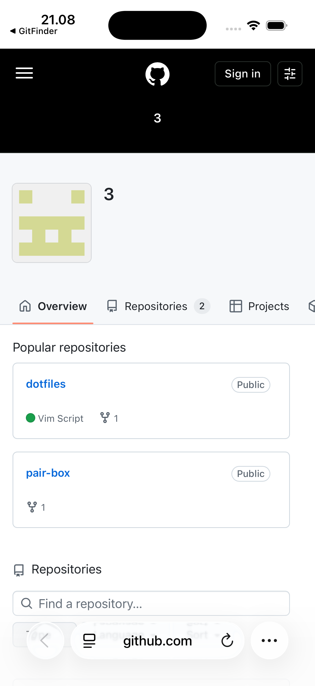

# GitFinder

A small app that shows a list of GitHub usernames, pulled from the public GitHub API. Tap a user to open a detail screen that fetches their profile by id, and from there you can open their profile on GitHub. I built it to practice VIPER + Clean Architecture.

## Tech stack

- Swift + UIKit, no storyboards
- VIPER (presentation) + Clean Architecture (overall structure)
- URLSession with async/await
- UITableView with a custom cell

## Screenshot

  
  
  
  

